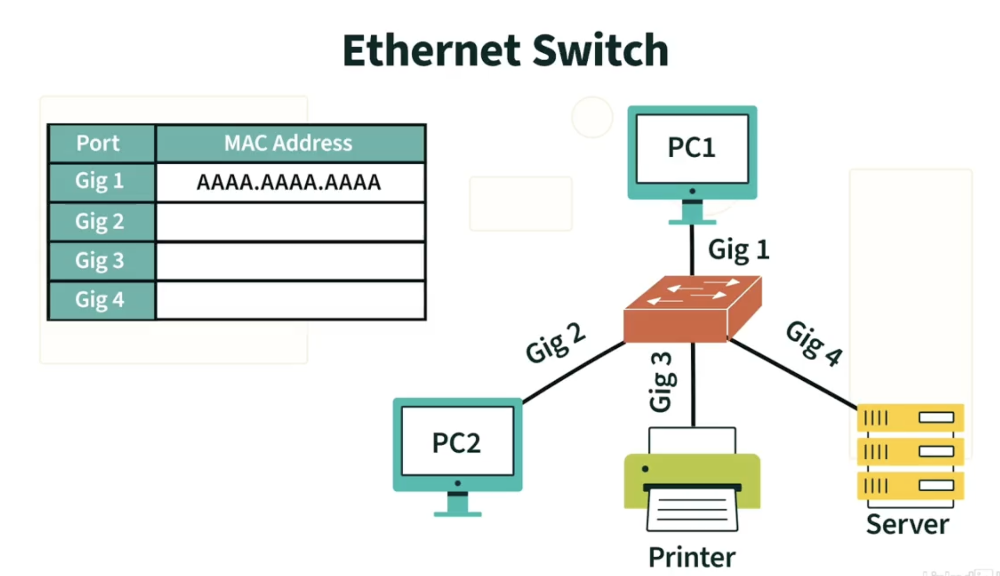
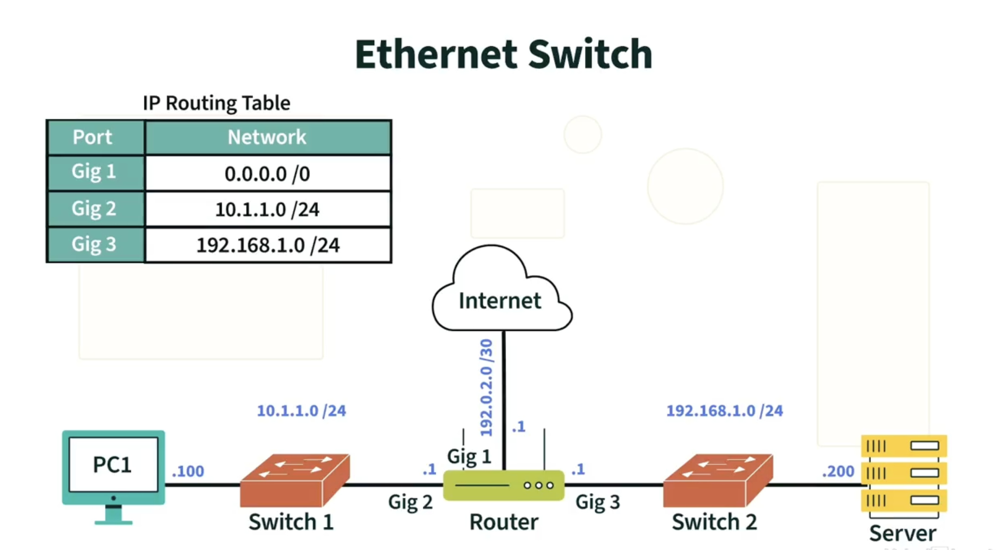
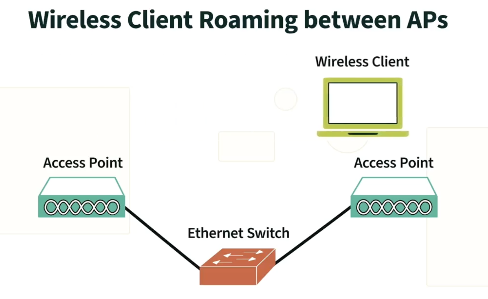
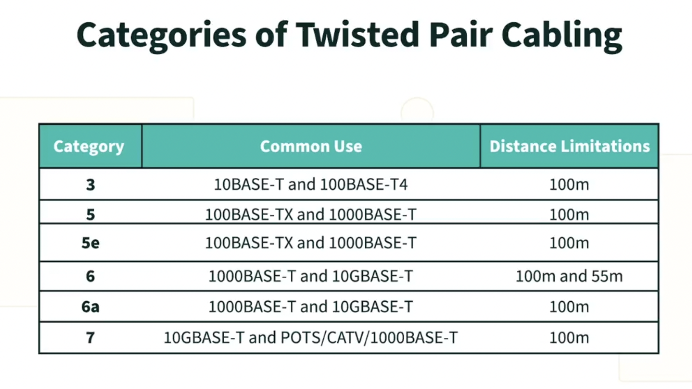
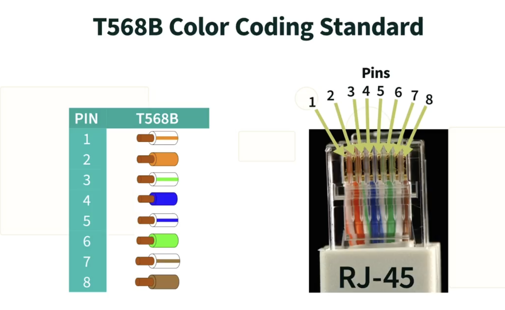

# Network Basics

### What is Network?
Collection of interconnected devices called network.
A device can be connected in network using one of the following way.
- Wired Connection
- Wireless Connection Network

### Network Type (By Scope)
- Personal Area Network(PAN)
- Local Area Network(LAN)
- Campus Area Network(CAN)
- Metropolitan Area Network(MAN)
- Wide Area Network(WAN) - Made over Internet

## Network Benefits
- Ability to share resource
- Communication (VoIP, Email, Instant msg)
- Redundency (send the copy of data to backup)
- Internet Access
- Monitor Connected devices
- Device Administration
- Internet of Things(Managing IoT devices)

# Network Addresses

#### Physical Address/Burned In Address
These address are assigned to network devices when they are manufactured.

### Media Access Control(MAC) Address
- Each NIC has unique mac address. No other device can have same mac address.
- WIFI and Ethernet will have different mac address since both uses different NIC card.s
- It's Made up of 48 bits (VENDOR CODE(24 bits) + (other 24 bits))

### Logical Address
It's need to be assigned to device as contrast to physical address which is hard coded at the time of manufacturing.
#### IPv4
- It's 4 octet(32 bit) address.
- It's Made up of two part network bits + host bits(where subnet mask decide the size of network bits)

ex - `192.16.255.255`

#### IPv6
- It's 128 bits length address.
- Made up of 8 quartet(4 hex number)
- It's made up of network bits and host bits
- Network bits decided by prefix length

ex - `2001:0db8:85a3:0000:0000:8a2e:0370:7334/64`

# Parts of Network

### Network Interface Card (NIC)
Basic device/circuit which provides functionality to connect with network.

Ex - NIC for wifi, NIC for ethernot port

### Switch
This device keeps devices keep connected together. Switch manages a table which keeps track of port and it's connected devices mac address. This table helps switch to route the data frame from source device to target device.

<!-- image -->

### Router
This device connects two different networks together. It routes the packet from one network to another network. It uses routing table to decide which path to use to route the packet. So router forwards the packet based on IP address unlike switch which forwards the frame based on MAC address.

### Wireless Access Point (WAP)
This device allows wireless devices to connect with wired network. It acts as a bridge between wired and wireless network.
It's not a router. It doesn't route the packet from one network to another network.

## Copper Cabling
Twisted pair cabling is most common type of copper cabling used in network. It's made up of 8 copper wires twisted together in 4 pairs. Each pair is color coded to identify the pair. The wires are twisted to reduce the electromagnetic interference.
There are two types of twisted pair cabling.
- Unshielded Twisted Pair (UTP)
- Shielded Twisted Pair (STP)
- Plenum Rated Cable (CMP) - Non toxic cable used in air ducts

**Note**: There are different categories of twisted pair cabling. The higher the category number, the higher the bandwidth and the faster the data transfer rate.Twisted cable have limitation on distance. The maximum distance for twisted pair cabling is 100 meters. Beyond this distance, the signal starts to degrade and data transfer rate decreases.

#### RJ45 Connector
It's used to connect the twisted pair cabling to the network device. It has 8 pins to connect 8 wires of twisted pair cabling.

### Fiber Optic Cabling
For long distance communication, fiber optic cabling is used. It uses light to transmit the data. It's made up of glass or plastic core surrounded by cladding which reflects the light back to the core. There are two types of fiber optic cabling.
- Single Mode Fiber (SMF)
- Multi Mode Fiber (MMF)
