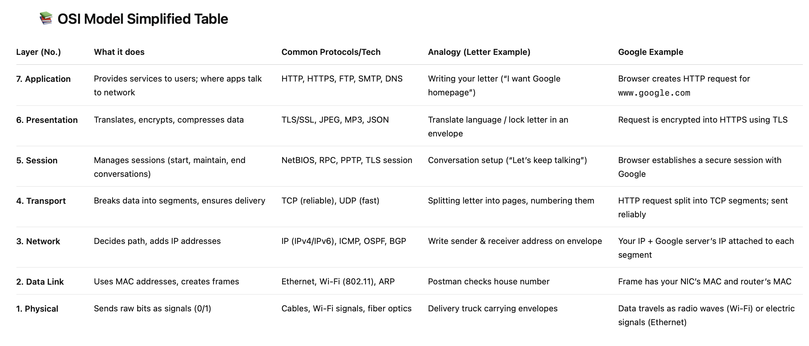
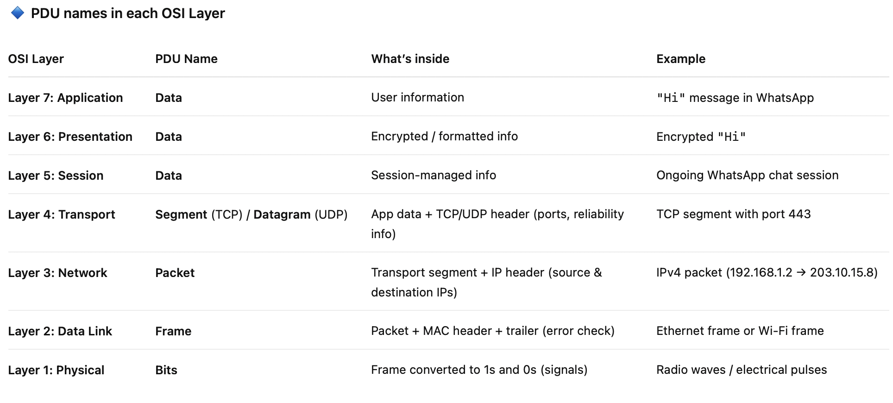
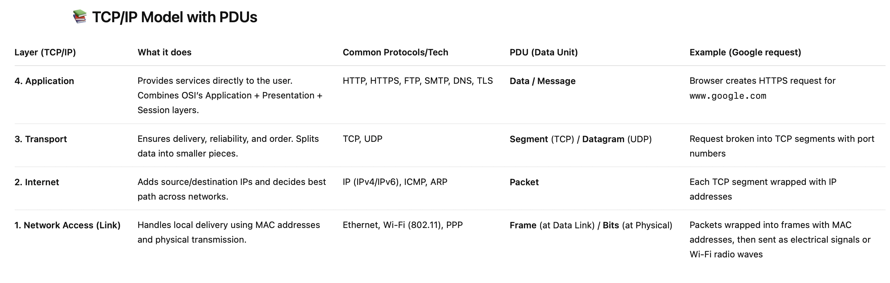
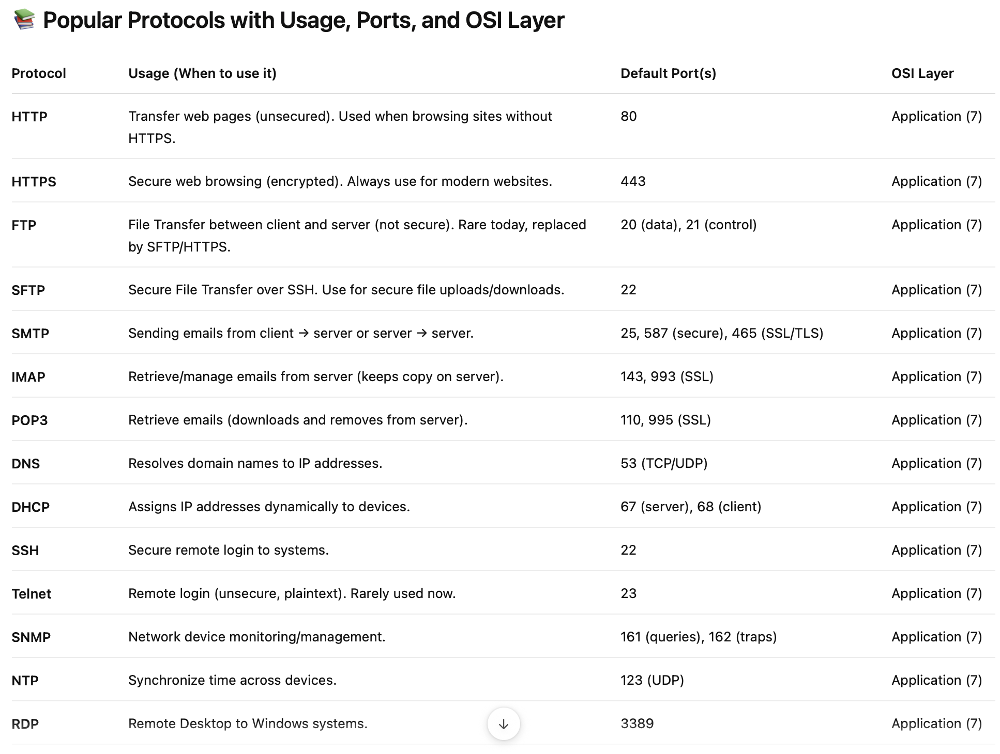
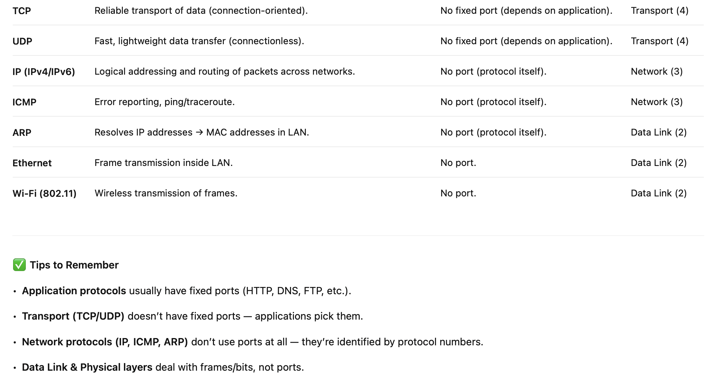
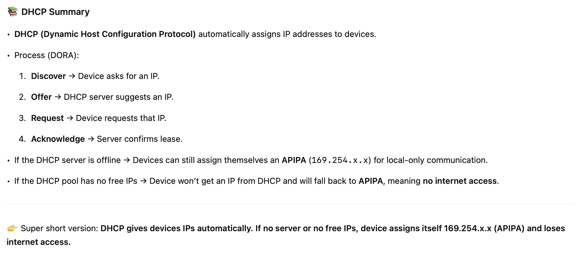

# Open System Interconnection(OSI) Model
1.	The OSI model is a step-by-step guide for how data moves between computers in a network.
2.	Application layer → where users interact (e.g., browser sending a request).
3.	Presentation layer → translates, encrypts, or compresses the data.
4.	Session layer → manages the conversation (start, maintain, end).
5.	Transport layer → breaks data into smaller pieces (segments) and ensures they arrive correctly and in order.
6.	Network layer → decides the path using IP addresses.
7.	Data Link layer → uses MAC addresses to deliver data inside the local network.
8.	Physical layer → turns data into signals (electrical pulses, light, or radio waves) that travel through cables or Wi-Fi.
9.	Each layer adds or removes its own “envelope,” so the message can safely travel from sender to receiver.

### OSI Model PDU
At the Transport layer, data becomes a segment, which the Network layer wraps with an IP header to make a packet, and then the Data Link layer wraps that packet with MAC addresses and error-check info to form a frame; finally, the Physical layer turns the frame into bits for transmission. In theory it’s a clean 1-to-1 mapping (one segment → one packet → one frame), but in practice it depends on the protocol — e.g., Ethernet usually keeps 1:1, while technologies like ATM or modern Wi-Fi (802.11n/ac/ax) can do segmentation or aggregation, meaning multiple packets may be split across frames or several packets combined into one frame (to improve efficiency).

## TCP/IP Model
⚡ Difference Between OSI and TCP/IP
1.	Number of Layers:
    - OSI has 7 layers.
    - TCP/IP has 4 layers (some OSI layers are combined).
2.	Nature:
    - OSI is a theoretical reference model (conceptual).
    - TCP/IP is a practical model (used in real-world networking).
3.	Usage:
    - OSI helps us learn and understand networking in detail, layer by layer.
    - TCP/IP is the actual protocol stack used on the internet.

# Protocols

## DHCP (Dynamic Host Configuration Protocol)

## DNS (Domain Name System)

# 🌐 NAT (Network Address Translation)

## What is NAT?
- NAT is a process that allows **multiple devices to share a single public IP address**.  
- It works by translating **private IPs (used inside home or local networks)** into a **public IP** (used on the internet).  
- From the outside world, all devices appear as if they are coming from **one IP address**.

---

## 🔹 Why NAT is Needed
- IPv4 has only **4.3 billion unique addresses**, which are not enough for all devices in the world.  
- NAT solves this problem by allowing many devices to hide behind a single public IP.  
- Example: 10 devices in your home use only **1 public IP** instead of 10.

---

## 🔄 How NAT Works
1. Each device in the LAN (e.g., phone, laptop) gets a **private IP** (like `192.168.x.x`).  
2. The router (or phone hotspot) has **one public IP** from the ISP.  
3. When a device sends data to the internet:
   - NAT **replaces the private IP** with the router’s public IP.  
   - It also assigns a **unique port number** to keep track of which device made the request.  
4. When the response comes back, NAT checks the port mapping and sends the reply to the correct private IP.  

---

## 🏠 Example: Home NAT
- Laptop → `192.168.1.2`  
- Phone → `192.168.1.3`  
- Router → `103.25.64.12` (public IP from ISP)  

Both laptop and phone appear as **103.25.64.12** on the internet.  
Router uses **ports** to know which reply belongs to which device.  

---

## 📱 Example: Mobile Hotspot
- Laptop connects to your phone’s hotspot.  
- Laptop gets a **private IP** like `192.168.43.101` from your phone.  
- Phone itself gets an IP from the **mobile carrier**:
  - Sometimes a **public IP**.  
  - Often a **private IP** (like `10.x.x.x`) with **Carrier-Grade NAT (CGNAT)**.  
- Phone performs NAT for your laptop, translating its private IP into the phone’s carrier IP.  

---

## 🔹 Carrier-Grade NAT (CGNAT)
- Used by mobile carriers and ISPs to conserve IPv4.  
- Many customers share **one public IP** at the ISP level.  
- Your phone may see a private IP (`10.x.x.x`), but websites see the ISP’s public IP.  
- This is why your phone and laptop may appear to have **different external IPs** in some cases.

---

## ✅ Benefits of NAT
- Saves IPv4 addresses (many devices use **1 public IP**).  
- Adds a layer of **security** since private IPs are hidden from the internet.  
- Allows local devices to communicate using private IPs.

---

## 🚨 Limitations of NAT
- Makes **incoming connections difficult** (requires port forwarding).  
- Can cause issues with **gaming, VoIP, or peer-to-peer apps**.  
- NAT complexity increases with **Carrier-Grade NAT**, making some applications harder to use.

---

## 🔑 Key Takeaways
- **At home:** Router gets 1 public IP → all devices share it via NAT.  
- **On mobile:** Phone gets IP from carrier → laptop gets private IP from phone → phone does NAT.  
- **If carrier runs CGNAT:** Multiple phones/customers share the same public IP at the ISP level.  
- NAT is the reason we are still able to use IPv4 widely despite address scarcity.  

# ⏰ NTP (Network Time Protocol)

## What is NTP?
- **NTP** (Network Time Protocol) is used to **synchronize clocks** of computers and devices over a network.  
- Without NTP, device clocks drift apart, causing problems in **logs, security, banking, and communication**.  
- NTP is extremely accurate:  
  - **Milliseconds** over the internet.  
  - **Microseconds** in local networks.

---

## 🔄 How NTP Works
1. Device sends a request to an NTP server.  
2. NTP server replies with the current time.  
3. Device uses **4 timestamps (T1–T4)** to calculate:  
   - **Delay** (round-trip network time).  
   - **Offset** (difference between device and server clocks).  
4. Device adjusts its clock gradually to stay in sync.  
5. NTP repeats periodically (every few minutes to hours) to keep time accurate.  

---

## 📚 Key Details
- **Port**: 123 (UDP)  
- **OSI Layer**: Application (Layer 7)  
- **Hierarchy**:  
  - Stratum 0 → Atomic/GPS clocks (most accurate).  
  - Stratum 1 → Servers directly connected to Stratum 0.  
  - Stratum 2+ → Devices syncing from higher strata.  

---

## ✅ Benefits of NTP
- Keeps all devices on the same time reference.  
- Essential for **security certificates, Kerberos, logs, banking, and distributed systems**.  
- Corrects for **network delay**, unlike simple time sync methods.  

---

## ⚖️ NTP vs HTTP Time Requests

| Feature              | **NTP**                           | **HTTP Time**              |
|----------------------|-----------------------------------|----------------------------|
| Protocol             | Specialized (UDP/123)             | General HTTP (TCP/80/443)  |
| Accuracy             | Milliseconds (internet), µs (LAN) | Often off by 100–500 ms+   |
| Delay Correction     | ✅ Yes (uses T1–T4 timestamps)     | ❌ No (ignores network delay) |
| Frequency            | Periodic sync, adaptive intervals | Only when polled manually  |
| Usage                | OS clock sync (default in OS)     | Simple APIs, IoT hacks     |

---

## 🔑 In Short
- **NTP = accurate, delay-aware clock sync** (used by all major OSes).  
- **HTTP = simple, but inaccurate** (delay ignored, only for lightweight apps).  
- That’s why NTP is the **standard protocol for time synchronization** worldwide.  