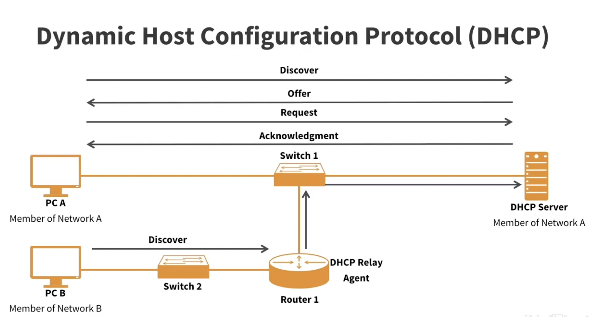
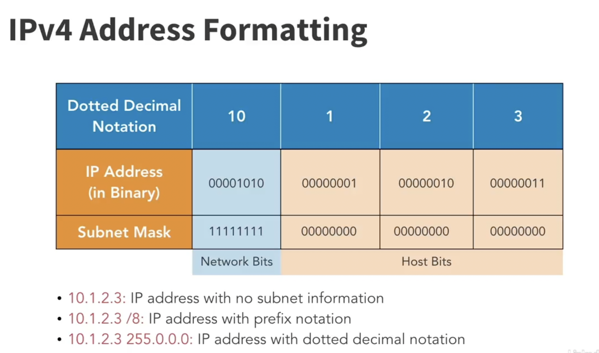
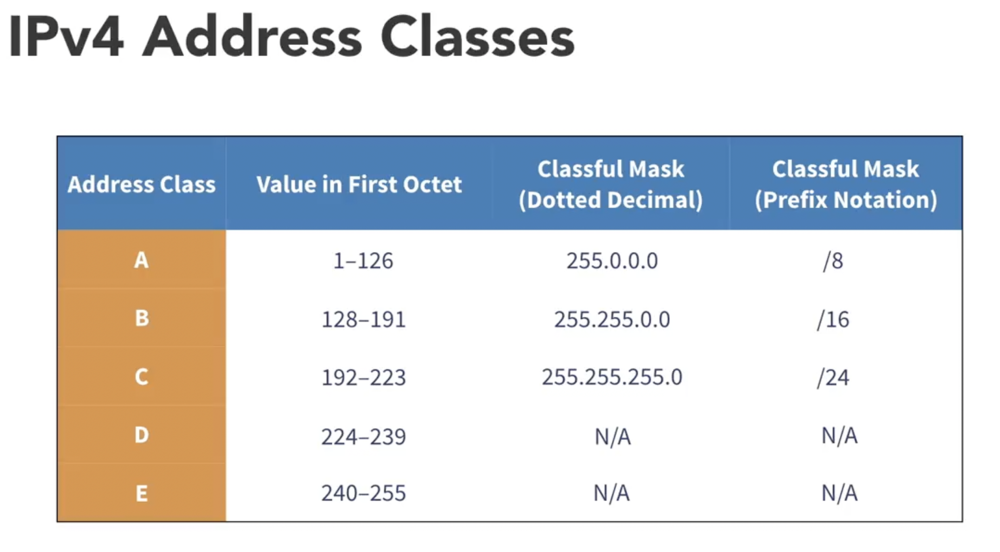

# Role of IP Address in Networking

An **IP address** is like a **unique home address** for every device in a network.  
It allows devices to find and talk to each other. Just as the postal system uses your
home address to deliver letters, computers use IP addresses to send and receive data.

## Example
- Your laptop has IP: `192.168.1.10`
- Google server has IP: `142.250.182.14`

When you open **google.com**:
1. Laptop sends a request to Google’s server (`142.250.182.14`).
2. Google replies back to your laptop using its IP (`192.168.1.10`).

## Two Parts of an IP Address
Every IP address is split into **two portions**:

### IPv4 (e.g., `192.168.1.10/24`)
- **Network ID** → Identifies the network (e.g., `192.168.1.0`).  
- **Host ID** → Identifies the device in that network (e.g., `.10`).  

### IPv6 (e.g., `2001:0db8:85a3::8a2e:0370:7334/64`)
- **Network Prefix** → Identifies the network (e.g., `2001:0db8:85a3::`).  
- **Interface ID** → Identifies the device’s interface (e.g., `8a2e:0370:7334`).  

👉 **Why we need them:**  
- The **network part** helps route data to the right network.  
- The **host/interface part** ensures data reaches the correct device in that network.

## Summary
- **IP Address = unique identifier for a device in a network**  
- Split into **Network Part + Host/Interface Part**  
- IPv4 → Network ID + Host ID  
- IPv6 → Network Prefix + Interface ID  
- Ensures data always reaches the correct sender and receiver  

# IP Address, Subnet Mask, Default Gateway, and DNS

## 1. IP Address
Unique identifier of a device in a network.  
Example: Laptop → `192.168.1.10`

## 2. Subnet Mask
Defines which part of the IP is the **network** and which is the **host**.  
Example: `255.255.255.0` → Network = `192.168.1`, Host = `.10`

## 3. Default Gateway
The "exit door" from your local network to other networks (usually the router).  
Example: `192.168.1.1`

## 4. DNS (Domain Name Server)
Translates domain names into IP addresses.  
Example: `google.com` → `142.250.182.14`  
Example DNS server: `8.8.8.8` (Google)

## Example Setup (Home Wi-Fi)
- **IP Address (Laptop):** `192.168.1.10`  
- **Subnet Mask:** `255.255.255.0`  
- **Default Gateway:** `192.168.1.1`  
- **DNS Server:** `8.8.8.8`  

# DHCP (Dynamic Host Configuration Protocol)

DHCP is a protocol that **automatically assigns IP configuration** to devices on a network.  
Without DHCP, each device would need manual IP setup.

## How DHCP Works
1. **Device joins network** → sends `DHCP Discover` (broadcast).
2. **DHCP Server replies** → with `DHCP Offer` (available IP + settings).
3. **Device requests** → the offered IP (`DHCP Request`).
4. **Server confirms** → with `DHCP Ack`.

👉 The device now has:
- IP Address
- Subnet Mask
- Default Gateway
- DNS Server

## DHCP Across Networks
- DHCP requests are broadcasts and **do not cross routers**.
- If the DHCP server is in another network, a **DHCP Relay (IP Helper)** on the router is used:
  - Router forwards the request as unicast to the remote DHCP server.
  - Server assigns an IP **from the subnet where the device is physically present**, not from its own network.
  - This ensures the device can talk to its local gateway.

**Example**  
- Device in `192.168.1.0/24`  
- DHCP server in `10.0.0.0/24`  
- Router relay forwards request.  
- DHCP server gives IP from `192.168.1.x` pool (e.g., `192.168.1.50`).  

## How DHCP Ensures IP Availability
1. **Lease Table** → Server tracks which IPs are already assigned and their lease times.
2. **Server Conflict Check (optional)** → Server may ARP/ping the IP before offering it.
3. **Client Check (mandatory)** → Device sends a *gratuitous ARP*:
   - If no one replies → safe to use.  
   - If conflict detected → DHCP restarts with a new IP.

## DHCP Lease
- Each IP is given for a **lease time** (e.g., 24 hours).
- Before expiry, the device must **renew the lease** with the server.
- If not renewed, the IP is released back to the pool.

## Quick Summary
- **DHCP = automatic IP configuration protocol.**
- Works via a 4-step exchange: Discover → Offer → Request → Ack.
- Across networks, needs a **DHCP relay**; IP will belong to the device’s subnet, not the server’s.
- Ensures IPs are unique using lease tables + ARP checks.
- Uses leases so IPs can be reused efficiently.

## IP Address Formatting

# IPv4 Address Classes and Special Ranges

## What are IPv4 Classes?
In the early internet, IPv4 addresses were divided into 
**classes** to separate big, medium, and small networks.

| Class | First Octet Range | Default Subnet Mask | Network/Host Split | Devices Possible | Use |
|-------|-------------------|----------------------|--------------------|------------------|-----|
| **A** | 1 – 126           | 255.0.0.0 (/8)       | 8 bits network, 24 bits host  | ~16 million | Very large networks |
| **B** | 128 – 191         | 255.255.0.0 (/16)    | 16 bits network, 16 bits host | ~65,000    | Medium networks |
| **C** | 192 – 223         | 255.255.255.0 (/24)  | 24 bits network, 8 bits host  | 254        | Small networks (home/office) |
| **D** | 224 – 239         | N/A                  | Not for hosts | N/A | Multicast |
| **E** | 240 – 255         | N/A                  | Not for hosts | N/A | Experimental |

---

## Why Do Classes Have Fixed Subnet Masks?
- In the **classful system**, each class had a default mask:
  - Class A → `/8` → `255.0.0.0`
  - Class B → `/16` → `255.255.0.0`
  - Class C → `/24` → `255.255.255.0`
- The class itself told you how many bits were **network vs host**.
- **Today**: This is outdated. We use **CIDR (Classless Inter-Domain Routing)** for flexible subnetting.

---

## Special Ranges You Should Know
1. **127.x.x.x**  
   - Reserved for **loopback (localhost)**.  
   - Example: `127.0.0.1` → always points to your own machine.  
   - That’s why Class A is only 1–126, not 127.

2. **0.x.x.x**  
   - Reserved to mean **"this network"** (not usable for hosts).

3. **255.x.x.x and .255 addresses**  
   - Used for **broadcast** (send to all devices in the subnet).  
   - Example: `192.168.1.255` → broadcast to all devices in `192.168.1.0/24`.

---

## Private IP Ranges (from classes)
These are reserved for internal networks (not routable on the internet):
- Class A private: `10.0.0.0 – 10.255.255.255`
- Class B private: `172.16.0.0 – 172.31.255.255`
- Class C private: `192.168.0.0 – 192.168.255.255`

Example: Your home Wi-Fi usually uses `192.168.x.x` (from Class C).

---

## Quick Summary
- IPv4 addresses were once divided into **Classes A–E**.  
- Each class had a **fixed default subnet mask**.  
- **127.x.x.x** → loopback, not for normal use.  
- **0.x.x.x & 255.x.x.x** → special (this network & broadcast).  
- Today, classes are **mostly obsolete**; we use **CIDR** instead.  
- Still useful to understand private IP ranges like `10.x.x.x` and `192.168.x.x`.  

# IPv6 Addressing

IPv6 is the successor to IPv4, designed to provide a much larger address space.

---

## IPv6 Address Format
- **Length**: 128 bits (compared to 32 bits in IPv4).
- **Written as**: 8 groups of 4 hexadecimal digits, separated by colons.
- Example:  
  `2001:0db8:85a3:0000:0000:8a2e:0370:7334`

### Shortening Rules
1. Leading zeros in a group can be removed:  
   `2001:db8:85a3:0:0:8a2e:370:7334`
2. Consecutive groups of all zeros can be replaced with `::` (only once in an address):  
   `2001:db8:85a3::8a2e:370:7334`

---

## IPv6 Categories (Types of Addresses)

### 1. **Unicast (One-to-One)**
- Identifies a single device.
- Types:
  - **Global Unicast**: Public IPs, routable on the internet. (e.g., `2000::/3`)
  - **Link-Local**: Used within a local link only, auto-assigned. (e.g., `fe80::/10`)
  - **Unique Local**: Private networks (like IPv4 private). (e.g., `fc00::/7`)

### 2. **Multicast (One-to-Many)**
- Packets sent to multiple devices at once.
- Example range: `ff00::/8`

### 3. **Anycast (One-to-Nearest)**
- Same address can be assigned to multiple devices.
- Data is delivered to the **nearest one** (routing decides).
- Used for load balancing, DNS servers, CDNs.

---

## Special IPv6 Addresses
- **Loopback**: `::1` → equivalent to IPv4 `127.0.0.1`
- **Unspecified**: `::` → means "no address"
- **IPv4-mapped IPv6**: `::ffff:192.0.2.128` → used to represent IPv4 inside IPv6.

---

## Comparison with IPv4
- IPv4: 32 bits → about 4.3 billion addresses.
- IPv6: 128 bits → about 340 undecillion addresses (almost infinite for practical use).
- No classes like IPv4 → uses **prefixes** (CIDR-style).

---

## Quick Summary
- IPv6 = 128-bit address, written in hexadecimal.
- Categories:
  - **Unicast** → one device
  - **Multicast** → multiple devices
  - **Anycast** → nearest device
- Special addresses: `::1` (loopback), `::` (unspecified).
- Much larger space than IPv4, no class system, uses prefixes instead.

# DNS (Domain Name System)

DNS is like the **phonebook of the internet**.  
It translates human-readable names (like `google.com`) into machine-usable IP addresses (like `142.250.182.14` for IPv4 or `2404:6800:4009:80f::200e` for IPv6).  
Without DNS, we would have to remember IP addresses instead of domain names.

---

## DNS Hierarchical Structure

DNS is organized in a **hierarchy** (tree-like structure):

1. **Root Level (`.`)**  
   - The top of the hierarchy.  
   - Managed by ICANN (Internet Corporation for Assigned Names and Numbers).  

2. **Top-Level Domains (TLDs)**  
   - Examples: `.com`, `.org`, `.net`, `.in`, `.uk`  

3. **Second-Level Domains**  
   - The actual website names chosen by organizations.  
   - Example: `google.com` → `google` is the second-level domain.  

4. **Subdomains**  
   - Created under second-level domains.  
   - Example: `mail.google.com` or `maps.google.com`.  

👉 Full example:  
`www.openai.com`  
- Root → `.`  
- TLD → `.com`  
- Second-level → `openai`  
- Subdomain → `www`  

---

## How DNS Works (Simplified)
1. You type `www.google.com` in a browser.  
2. Your computer asks the **DNS resolver** (usually your ISP’s or public like 8.8.8.8).  
3. Resolver queries:  
   - Root servers → “Where is `.com` TLD server?”  
   - TLD server → “Where is `google.com` authoritative server?”  
   - Authoritative server → “The IP for `www.google.com` is 142.250.182.14.”  
4. Resolver caches the result and returns it to you.  
5. Browser connects to that IP.  

---

## DNS Record Types (Why We Need Them)

DNS doesn’t just store IP addresses. It has different **record types** for different needs:

- **A Record** → Maps domain to IPv4 address.  
  Example: `example.com → 93.184.216.34`

- **AAAA Record** → Maps domain to IPv6 address.  
  Example: `example.com → 2606:2800:220:1:248:1893:25c8:1946`

- **CNAME (Canonical Name)** → Alias for another domain.  
  Example: `www.example.com → example.com`

- **MX (Mail Exchange)** → Specifies mail servers for email delivery.  
  Example: `example.com → mail.example.com`

- **NS (Name Server)** → Points to authoritative DNS servers for a domain.  

- **TXT Record** → Stores arbitrary text, often used for security (SPF, DKIM, domain verification).  

- **PTR (Pointer)** → Reverse DNS, maps IP → domain name.  

- **SRV Record** → Defines services and ports (used in VoIP, IM, etc.).  

---

## Why We Need DNS
- **Human-friendly**: Easy names instead of numbers.  
- **Scalable**: Hierarchical design distributes load worldwide.  
- **Flexible**: Supports web, email, services with different record types.  
- **Efficient**: DNS caching reduces repeated lookups.  
- **Critical for security**: TXT records help verify domains, block spoofing, and authenticate emails.  

---

## Quick Summary
- DNS = Internet’s phonebook, maps names to IPs.  
- Hierarchical structure: Root → TLD → Second-level → Subdomain.  
- Key record types: A, AAAA, CNAME, MX, NS, TXT, PTR, SRV.  
- Needed because humans use names, machines use IPs, and services need multiple mappings.  